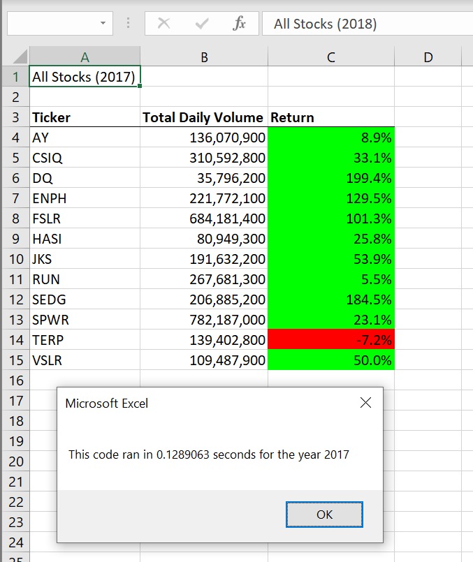
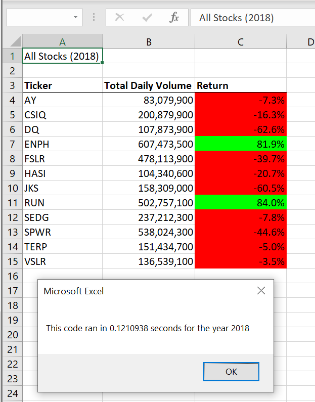

# Stock-analysis-with_VBA

## Overview of Project
The project is to run stock market analysis for different stock tickers over the last few years. The project applies optimized algorithm to better save computational calculation.

## Results

### Stock performance comparison between 2017 and 2018
The analysis results for all tickers in 2017 and 2018 are shown below. It can be concluded that the stock performance in 2018 is better than 2017 as more tickers indicate positive return.

