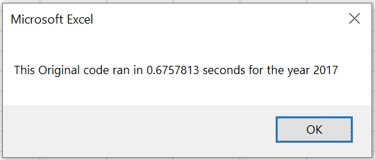
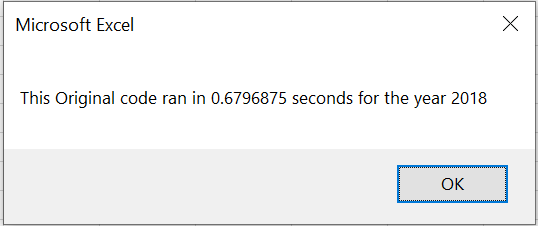

# Stock-analysis-with_VBA

## Overview of Project
The project is to run a stock market analysis for different stock tickers over the last few years. The project applies an optimized algorithm to better save computational calculation for processing data.

## Results

### Stock performance comparison between 2017 and 2018
The analysis results for all tickers in 2017 and 2018 are shown below. It can be concluded that the stock performance in 2018 is better than in 2017 as more tickers indicate positive return.

### The execution time results comparison between the original script and the refactored script are shown below:

## Summary

- What are the advantages or disadvantages of refactoring code?

Advantage:

1. Refactoring code can make the script more efficient and run faster. 

2. Save more computational resources and use less memory.

Disadvantage:

1. It can be very time consuming for developers to fully understand others' codes and successfully refactor them.

- How do these pros and cons apply to refactoring the original VBA script?

From the execution time comparison, the refactored code is 5~6 times faster than the original one. However, it did take a long time for me to reconstruct the algorithm to achieve the performance efficiency.

